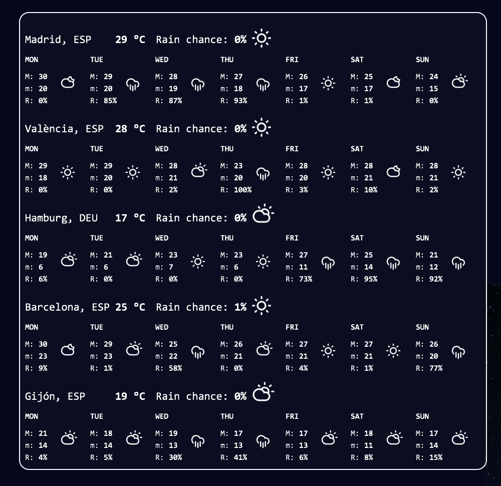

Multiple Locations Weather
==========================
**Author**: Rubén Abad



Get Übersicht at [http://tracesof.net/uebersicht/](http://tracesof.net/uebersicht/)

Install by moving the folder `multiple-locations-weather.widget` to the Übersicht widget folder. Fill the `apiKey` variable in `index.coffee`. API key must be retrieved from [Forecast.io](https://developer.forecast.io/).

The following options can be customized:

* `locations` -- Object containing the locations to display. Each location has an id (the object attribute name), a name,
 a latitude and a longitude.
Ex:

``` javascript
    lnd:
       name: "London"
       lat: 51.50722
       lng: -0.12750
```

where `lnd` is the location id to be used when building the HTML.

 * `theme` -- currently available themes are `black` and `white`.

 * `unit` -- degree units; `c` for celsius, `f` for fahrenheit

 * `refreshFrequency` -- Refresh interval. [Forecast.io](https://developer.forecast.io/) allows to make a maximum of 1000 free queries/day. Number of queries will depend on number of locations and refresh frequency.

Icons designed by [Adam Whitcroft](http://adamwhitcroft.com/climacons/).
